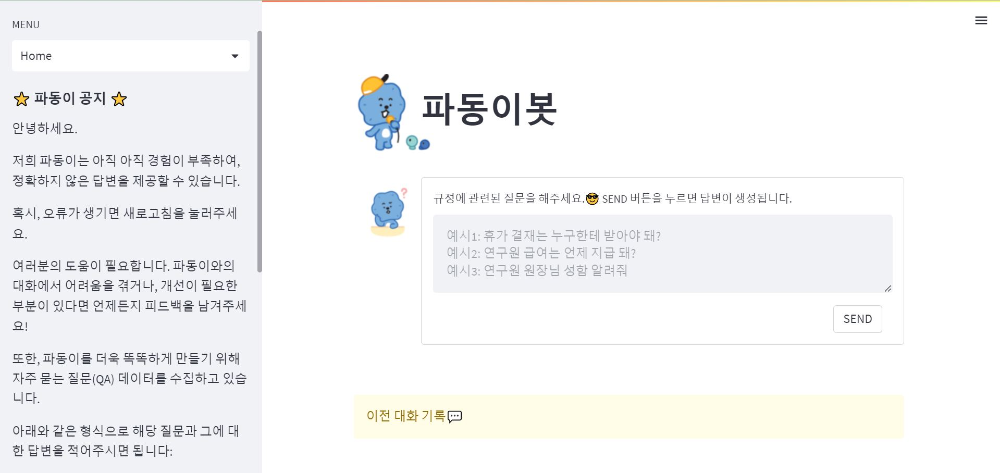
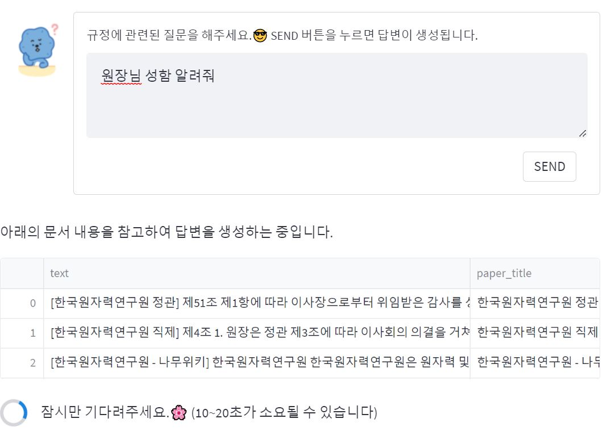
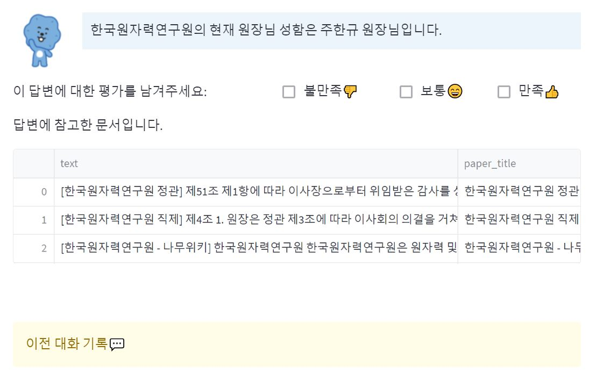
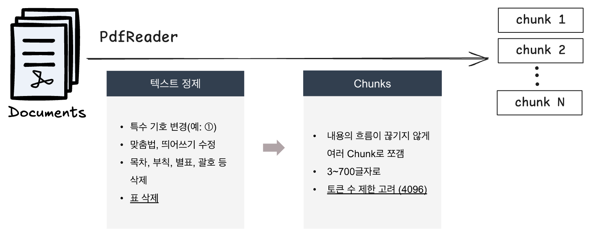
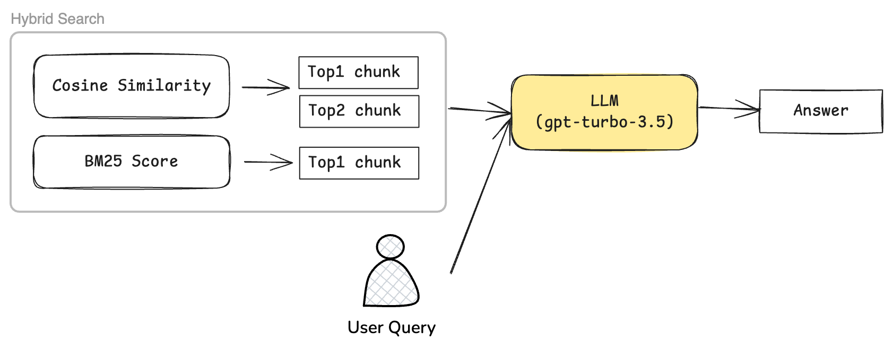
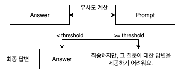
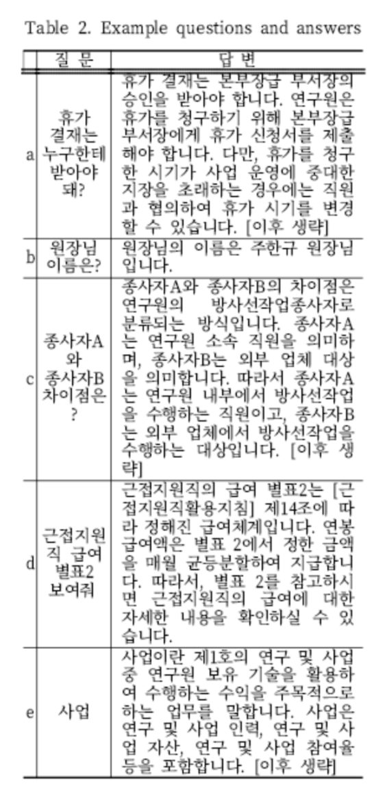

<h1>
     파동이봇
</h1>

파동이봇은 한국원자력연구원 규정 및 연구원 정보에 관한 질문에 대해 자세하고 정확한 답변을 제공하는 서비스입니다.\
보안의 이유로 본 REPOSITORY에는 일부 파일만 공개하고 있습니다.
<br>

## 💭 서비스 화면

1) 초기화면<br>
<br>

2) 질문 입력 및 답변 생성 과정<br>
<br>

3) 답변 생성 및 참고 문서 제공<br>

<br>
<br>
<h2>2️⃣ 주요 기능</h2>
&nbsp; - 사용자의 질문에 대한 정확하고 자세한 답변 제공<br>
&nbsp; - OpenAI API를 이용한 텍스트 임베딩 및 문장 간 유사성 계산<br>
&nbsp; - 대화 기록을 관리하고, 사용자와 파동이봇 간의 소통을 시각화<br>
<br>

<h2>3️⃣ 서비스 구성</h2>
&nbsp; - 질문 입력: 사용자로부터 규정에 관한 질문을 입력받음<br>
&nbsp; - 답변 생성: 입력된 질문을 바탕으로, 한국원자력연구원의 규정 문서에서 유사한 내용을 찾아 답변 생성<br>
&nbsp; - 대화 기록: 사용자와 파동이봇 간의 소통 내용을 시각화하고 관리<br>
&nbsp; - 참고 문서: 답변에 참고한 문서를 사용자에게 제공.<br>
<br>

<h2>4️⃣ 파이프라인</h2>
<div>


<br><br>
</div>

### 1. 문서 전처리 및 Retrieval 준비


- 🔎 For Hybrid Search
  - BM25 검색을 위한 chunk 토큰화
  ```
  def tokenizer(sent):
    sent = okt.morphs(sent, norm=False, stem=True)
    return sent

  embeddings = [tokenizer(doc) for doc in df.iloc[:,0]]
  bm25 = BM25Okapi(embeddings)
  ```
  - Cosine Similarity 계산을 위한 chunk 임베딩
  ```
  embedding_model = "text-embedding-ada-002"
  embeddings = df.iloc[:,0].apply([lambda x: get_embedding(x, engine=embedding_model)])
  ```

### 2. Retrieval & Generate Answer


### 3. Answer Verification


### 4. 평가
> 📄 [[논문]](https://www.dbpia.co.kr/journal/articleDetail?nodeId=NODE11554935) 거대언어모델과 문서검색 알고리즘을 활용한 한국원자력연구원 규정 질의응답 시스템 개발

검색 및 답변 평가 항목\
✔ 규정 문서를 참고했나요?\
✔ 공개된 문서(예: ALIO, 나무 위키)를 참고했나요?\
✔ 부서에서 제공한 문서를 참고했나요?\
✔ 표나 링크를 인식해서 답변했나요?\
✔ 모델의 내부 지식으로 답변할 수 있는 질문에도 문서 정보를 기반으로 답변했나요?


<h2>5️⃣ 세미나 영상 </h2>

📹 [[Youtube]](https://www.youtube.com/live/NLI1REMI51s?feature=share) 한국원자력연구원의 챗봇 파동이봇: 좌충우돌 개발 여정 (한국원자력연구원 김홍비 인턴연구원)

<!--
<br>
<h2>6️⃣ 업데이트</h2>
<table>
  <thead>
    <tr>
      <th>날짜</th>
      <th>모델</th>
      <th>서비스</th>
    </tr>
  </thead>
  <tbody>
    <tr>
    <td> 2023-03-24<br><br><br></td>
      <td>
        1. 이전 질문을 고려하여 답변 생성(추가 개선 중)<br>
        2. 답변 말투 일관되게 수정<br><br></td>
      <td>
        1. 이전 질문-답변을 페이지에 유지<br>
        2. 예시 질문 추가<br>
        3. 파동이 그림 추가 및 투명 배경으로 수정<br></td>
    </tr>
    <td> 2023-03-26<br><br></td>
      <td>
        1. 속도 개선을 위한 시도 → 빨라짐. 하지만 번역 오류<br>
        한국어 질문 → 영어로 gpt에 입력 → 영어로 된 답변을 한국어로 번역</td>
      <td>
        <br><br></td>
    </tr>
    <td> 2023-03-27<br><br></td>
      <td>
        1. 전처리 꼼꼼하게 다시!!<br>
        [비교]<br>
        2. 문서 단락 300/ 500글자씩 나눈 뒤 비교<br>
        3. 영어 번역 vs. 300 vs. 500</td>
      <td>
        [비교]<br>
        1. 더 빠른 답변(번역)/ 빠른 답변(300)/ 정확한 답변(500) 옵션 추가 (For test)<br>
        2. 새로운 주제 옵션 추가 - 관련 없는 이전 질문에 영향을 받기 때문이다…</td>
    </tr>
    </tr>
    <td>2023-04-03<br><br></td>
      <td>
        1. 전처리 꼼꼼하게 문서 다 살펴보기😵‍💫 <br>
        <li>맞춤법, 기호</li>
        <li>제*장, 제*조로 나눠서 내용의 흐름이 끊기지 않게 수정</li>
        <a href="https://github.com/Hongbi-Kim/KAERI_BOT_beta/blob/master/preprocessing">👉🏻 전처리 code 및 설명</a> 
      <td>
        <br>
      </td>
    </tr>
    <td> 2023-04-07<br><br></td>
      <td>
        1. 질문 관련 문서 검색 process 변경<br>
        <li>cosine similarity : 2개 추출</li>
        <li>bm25 : 1개 추출</li>
        2. 문서 추가 및 문서를 더 세분화해서 전처리
      <td>
        1. DB 저장(질문-답변-평가)<br>
        2. 답변 만족도 체크 기능<br>
        3. gpt 답변 생성 서버와 streamlit 앱 서버 분리<br>     (분산시스템 구축)
      </td>
    </tr>
    </tr>
    <td> 2023-05<br></td>
      <td>
      베타 서비스 공개<br><br>
      </td>
      <td>
      이후 업데이트는 웹페이지에 적어둠.<br>
      피드백 주기적 반용 중
      </td>
  </tbody>
</table>
<br> -->

<!-- 
```
pip install -r requirements.txt

os.environ["OPENAI_KEY"]
``` -->

<h2>6️⃣ 참고 자료</h2>
&nbsp; - <a href="https://github.com/mukulpatnaik/researchgpt">Researchgpt</a>
<p>&nbsp; - <a href="https://cloud.google.com/sdk/docs?hl=ko">Google Cloud</a></p>